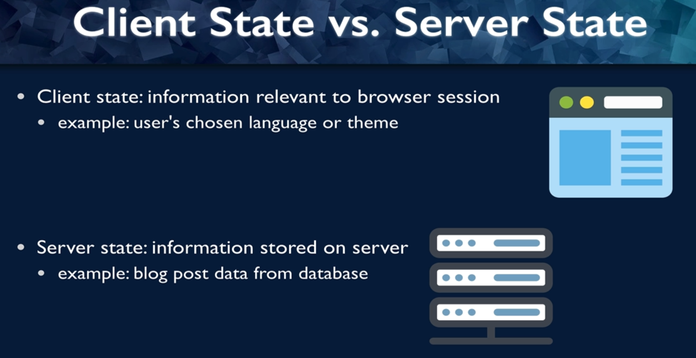
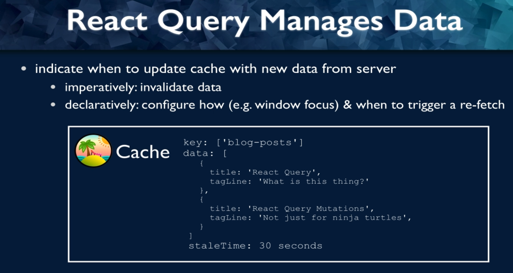

# 01 - Creating Queries and Loading  Error states

This is the readme file for the 01 - Creating Queries and Loading  Error states folder.

## 001 Introduction to React Query

The image you've shared compares **Client State** vs. **Server State**. These are two important concepts in web development, particularly when building applications that involve client-server interactions. Let’s dive deeply into both and explore examples to clarify how they work.

---

### **Client State: Information Relevant to Browser Session**

**Client state** refers to the data that is stored and maintained on the client’s side (usually within the browser). This data is typically transient, only lasting for the duration of a session or until the browser is closed. Client state is managed within the browser using mechanisms like cookies, local storage, session storage, or in-memory storage (JavaScript variables).

#### Key Characteristics:
- **Short-lived**: Client state typically lasts for the duration of the session or until the page is refreshed or closed.
- **Accessibility**: It is stored in the browser and is accessible only to that specific user.
- **Security**: Client state can be less secure, as it is stored on the user's device. Sensitive information should not be stored on the client side without proper encryption or security.

#### Example: User's Chosen Language or Theme
A very common example of client-side state is when a user selects a theme (light/dark mode) or a language preference, and this preference is saved in the browser so that the next time the user visits the page, the preference remains.

##### Example Code for Theme Selection:

```html
<!DOCTYPE html>
<html>
<head>
  <title>Client State Example - Theme</title>
  <style>
    body.dark-mode {
      background-color: black;
      color: white;
    }
  </style>
</head>
<body>
  <h1>Choose Your Theme</h1>
  <button onclick="setTheme('dark')">Dark Mode</button>
  <button onclick="setTheme('light')">Light Mode</button>

  <script>
    // Check for saved theme in localStorage
    const savedTheme = localStorage.getItem('theme');
    if (savedTheme) {
      document.body.classList.add(savedTheme);
    }

    // Function to set theme
    function setTheme(theme) {
      if (theme === 'dark') {
        document.body.classList.add('dark-mode');
        localStorage.setItem('theme', 'dark-mode'); // Save preference to localStorage
      } else {
        document.body.classList.remove('dark-mode');
        localStorage.setItem('theme', ''); // Remove theme from localStorage
      }
    }
  </script>
</body>
</html>
```

##### Explanation:
- **Client-Side Storage**: Here, we store the user’s theme preference in **`localStorage`**, which allows the browser to persist the state across sessions. The next time the user opens the page, their preferred theme is applied automatically.
- **LocalStorage**: Unlike session storage (which is cleared when the page is closed), **`localStorage`** persists until it is manually cleared or the browser's storage is reset.

### **Other Client-Side Storage Options:**

- **Session Storage**: Similar to `localStorage`, but data is only stored for the duration of the page session (i.e., the data is lost when the page is closed).
- **Cookies**: Small pieces of data stored on the client-side that can be sent back and forth between the client and server with each HTTP request. Often used for tracking sessions.

### **Limitations of Client State**:
- **Data size limitations**: Storage mechanisms like `localStorage` and cookies have strict size limits (e.g., 5MB for `localStorage`).
- **Security issues**: Since client-side data is stored on the user’s device, it can be manipulated or accessed by malicious parties if not properly secured.
  
---

### **Server State: Information Stored on the Server**

**Server state** refers to the data that is stored and managed on the server side. This data is usually more persistent and can be shared between multiple users or sessions. The server state is typically stored in a database or server-side memory.

#### Key Characteristics:
- **Long-lived**: Server state is generally more persistent than client state and can be stored for a long time (days, months, or even years).
- **Accessible by multiple clients**: The server state can be accessed by multiple clients or users, depending on the application.
- **Secure**: Server-side data is generally more secure since it's stored on the server and can only be accessed by authenticated and authorized clients.

#### Example: Blog Post Data from a Database
Consider an application where users can read blog posts. The actual blog post data (title, content, author, date, etc.) is stored on the server in a database, and the server sends this data to the client when requested.

##### Example Code for a Node.js Server that Manages Server-Side State (Blog Posts):

```javascript
const express = require('express');
const app = express();
const port = 3000;

// Simulate blog post data stored on the server (in reality, this would come from a database)
const blogPosts = [
  { id: 1, title: 'First Post', content: 'This is the first blog post.' },
  { id: 2, title: 'Second Post', content: 'This is the second blog post.' }
];

// Route to fetch all blog posts
app.get('/posts', (req, res) => {
  res.json(blogPosts); // Send blog post data as a JSON response
});

// Route to fetch a single blog post by ID
app.get('/posts/:id', (req, res) => {
  const postId = parseInt(req.params.id);
  const post = blogPosts.find(p => p.id === postId);

  if (post) {
    res.json(post);
  } else {
    res.status(404).send('Post not found');
  }
});

app.listen(port, () => {
  console.log(`Server running on http://localhost:${port}`);
});
```

##### Explanation:
- **Server-Side Data**: In this example, the blog post data (`blogPosts`) is stored on the server. The client can request the blog post data through the `/posts` endpoint.
- **Persistent Storage**: In a real-world scenario, the blog post data would be stored in a database (like MySQL, MongoDB, etc.), which would allow for data persistence across sessions and users.

### **How the Client Accesses Server-Side Data:**

When a client requests the blog post data (using a URL like `http://localhost:3000/posts/1`), the server fetches the data from the database or in-memory store and sends it to the client. The client doesn’t store or maintain this data — it simply requests it from the server as needed.

### **Comparison Between Client State and Server State**

| **Client State**                                                            | **Server State**                                                         |
| --------------------------------------------------------------------------- | ------------------------------------------------------------------------ |
| Stored on the client’s device (e.g., browser storage).                      | Stored on the server (e.g., in a database or server memory).             |
| Data is transient and short-lived (e.g., user preferences, session data).   | Data is persistent and long-lived (e.g., user accounts, blog posts).     |
| Managed using cookies, local storage, or session storage.                   | Managed using databases or server-side files.                            |
| Limited in size and subject to security vulnerabilities on the client side. | More secure and scalable, with larger data storage options.              |
| Examples: User preferences (language, theme), form input.                   | Examples: Blog post data, user account information, transaction records. |

### **Client-Server Interaction: Combining Client and Server States**

In real-world applications, both client and server states often work together. The client will maintain some temporary, session-specific data, while the server holds more permanent, structured data. Here’s a flow of how they interact:

1. **User interacts with the client**: The user may interact with a web page that has stored their theme or language preference on the client side.
   
2. **Client makes a request to the server**: The client might send a request to the server to fetch user-specific or application-specific data (e.g., user profile, blog posts).
   
3. **Server processes the request**: The server fetches the requested data from its database and sends it back to the client.
   
4. **Client displays the data**: The client uses this data to render the web page, allowing the user to interact with server-side data (like reading a blog post) while maintaining their client-side preferences.

### **When to Use Client State vs. Server State**

- **Use Client State** when:
  - You are dealing with temporary data that’s specific to a user session (e.g., shopping cart items, UI preferences).
  - You want to enhance user experience by saving state across sessions (e.g., dark mode settings).

- **Use Server State** when:
  - The data needs to be shared across multiple clients or sessions (e.g., blog posts, user profiles).
  - You need to ensure data security and persistence over time (e.g., financial transactions, user data).

---

### **Conclusion**

Understanding the difference between **client state** and **server state** is crucial for building scalable and secure applications. Client state is short-lived and resides on the user's browser, typically used for preferences or session-related data. Server state, on the other hand, is long-lived and stored securely on the server, ideal for persistent data like user information, blog posts, or application logic.

A good application design involves efficiently balancing between these two states to enhance user experience, performance, and security.


The image you've uploaded addresses a key question: **What problem does React Query solve?** React Query helps developers manage **server-side state** on the **client side** by caching and synchronizing data between the server and the client. Let’s break down this concept and go through examples to better understand how React Query operates, and what problems it addresses in React applications.

---

### **What Problem Does React Query Solve?**

React Query simplifies **server-side data fetching** and **caching** in React applications. It provides a declarative approach to manage asynchronous data and handles several complexities for you, including:

- **Caching**: Once data is fetched from the server, React Query stores (caches) it on the client side, allowing for instant retrieval on subsequent requests.
- **Refetching**: React Query can automatically refetch data when needed (e.g., when data becomes stale or after a page re-renders).
- **Error handling**: It manages asynchronous request errors and retries failed requests.
- **Synchronized state**: It keeps server-side data synchronized with the client side, ensuring the client always has up-to-date information.

---

### **Challenges Without React Query**

In a typical React application, fetching and managing server-side data can become complex, especially when you need to:

1. **Manually manage loading, errors, and data**.
   - Fetching data from an API often requires writing code for loading states, error handling, and keeping track of when to refetch data.
   
2. **Handle caching efficiently**.
   - If the same data is requested multiple times, you'll need to decide when to use cached data and when to refetch it from the server. Without a caching mechanism, you could be over-fetching data unnecessarily.

3. **Synchronize server data with UI state**.
   - It can be tricky to ensure that the data you are displaying in the UI matches what is stored on the server, particularly when other parts of the app may modify the data.

4. **Refetch data when it becomes stale**.
   - Without proper management, stale data (data that is out of sync with the server) can be shown to the user, leading to a poor user experience.

---

### **How React Query Solves These Problems**

#### **1. Caching Server Data on the Client Side**

React Query caches the data fetched from the server, meaning that once data has been fetched, it can be reused in other parts of the application without needing to make another network request.

This not only improves performance (since you avoid redundant requests) but also provides a smoother user experience (e.g., by instantly displaying cached data).

#### Example: Fetching Data with React Query

Let’s fetch user data from a server and cache it with React Query.

```jsx
import { useQuery } from 'react-query';

function fetchUsers() {
  return fetch('https://jsonplaceholder.typicode.com/users')
    .then(response => response.json());
}

function UsersList() {
  const { isLoading, error, data } = useQuery('users', fetchUsers);

  if (isLoading) return <div>Loading...</div>;

  if (error) return <div>Error: {error.message}</div>;

  return (
    <ul>
      {data.map(user => (
        <li key={user.id}>{user.name}</li>
      ))}
    </ul>
  );
}

export default UsersList;
```

#### Explanation:
- **`useQuery`**: This hook is provided by React Query. It takes two arguments:
  1. A unique query key (`'users'` in this case) that React Query uses to store and identify the cached data.
  2. A function that fetches the data from the server (in this case, `fetchUsers()`).
  
- **Loading and Error States**: React Query automatically manages the loading state (`isLoading`) and error state (`error`) for you, removing the need for manually managing these states.

- **Caching**: Once the user data is fetched, React Query caches it on the client side. If the `UsersList` component is rendered again and the data is still fresh, it will be retrieved from the cache rather than making another network request.

#### **2. Refetching and Syncing Data with the Server**

React Query ensures that the client always has up-to-date data. It automatically refetches data in various situations:
- When the component remounts.
- When the browser window is refocused.
- When the network connection is restored after being offline.

You can also manually trigger a refetch when needed.

```jsx
const { data, refetch } = useQuery('users', fetchUsers);

return (
  <div>
    <button onClick={() => refetch()}>Refetch Users</button>
    <ul>
      {data.map(user => (
        <li key={user.id}>{user.name}</li>
      ))}
    </ul>
  </div>
);
```

In this case, the "Refetch Users" button allows the user to manually trigger the refetching of user data, ensuring the UI is synchronized with the latest server data.

#### **3. Managing Stale Data**

By default, React Query marks the data as "stale" after a certain period. When the data becomes stale, React Query refetches it the next time it's needed, ensuring the client always has the most up-to-date information.

You can customize the cache time (how long data stays fresh) and refetch intervals using options:

```jsx
const { data, isLoading } = useQuery('users', fetchUsers, {
  staleTime: 30000,  // Data stays fresh for 30 seconds
  cacheTime: 600000, // Cached data remains in memory for 10 minutes
});
```

- **`staleTime`**: Determines how long the data is considered fresh. If it’s still fresh, React Query will return cached data.
- **`cacheTime`**: Specifies how long React Query should keep the cached data in memory before garbage collecting it.

---

### **React Query Workflow:**

Here’s how React Query typically works:

1. **React Code Requests Data**: In your component, you use the `useQuery` hook to request data.
2. **React Query Checks Cache**: React Query first checks its cache to see if the data is available and fresh.
3. **Server Request** (if needed): If the data is not available in the cache (or is stale), React Query will fetch it from the server.
4. **Cache the Data**: Once the data is fetched, React Query caches it on the client side.
5. **Return Data to Component**: React Query returns the cached (or freshly fetched) data to the component.

This process is illustrated in the image where:
- **React Code** (on the left) requests data.
- **React Query Cache** (in the middle) handles cached data and decides if a new server request is necessary.
- **Server** (on the right) provides fresh data when needed.

---

### **Real-World Example:**

Imagine you are building a **social media dashboard** where users can view their posts and analytics. You need to fetch post data from the server frequently (since posts or analytics can change). Instead of manually fetching and caching this data, React Query can be used to efficiently manage server state on the client.

1. **Caching Post Data**: React Query will cache the post data once it's fetched. If the user navigates between different parts of the dashboard and returns to the post feed, React Query will provide the cached post data instantly, improving performance.

2. **Auto-Refetching**: React Query can automatically refetch post data every 30 seconds to keep the client-side data in sync with the server.

3. **Error Handling**: If there is a network error while fetching post data, React Query will handle this gracefully by retrying the request and showing an error message if necessary.

---

### **Benefits of Using React Query**

- **Declarative Data Fetching**: You no longer have to manually manage asynchronous data fetching, error handling, or loading states in your components.
  
- **Automatic Caching and Refetching**: React Query automatically caches and refetches data, ensuring that your application always has fresh data without redundant requests.

- **Out-of-the-box Features**: React Query provides powerful features like data synchronization, error retries, pagination, and infinite scrolling, all of which are difficult to manage manually.

---

### **Conclusion**

React Query simplifies the process of managing **server state** in React applications by handling:
- **Data fetching** (with caching and synchronization).
- **Error handling** (with retries and fallback).
- **Stale data management** (automatic refetching when data becomes stale).
- **Client-side caching** (to improve performance and reduce redundant server requests).

By using React Query, developers can focus on building user interfaces and core application logic without worrying about managing server data manually, which leads to cleaner, more maintainable code.


The image focuses on how **React Query manages data**, specifically emphasizing the way it handles **caching** and **refetching** server-side data on the client side. The key features highlighted are:

1. **Indicating when to update the cache with new data from the server**:
   - **Imperatively**: By **invalidating** data manually.
   - **Declaratively**: By **configuring** how and when to trigger a re-fetch, for instance, when the browser window gains focus.

### **React Query and Data Management**

React Query is a powerful library for managing **server-side state** in React applications. It automatically fetches, caches, synchronizes, and updates data without requiring manual effort. It lets developers indicate when the data should be fetched, cached, and refetched, offering flexible ways to manage the data lifecycle.

Let’s explore **how React Query manages data deeply with examples**.

---

### **How React Query Caches and Manages Data**

The cache in React Query holds data that has been fetched from the server. Each cache entry has:
- **Key**: A unique identifier for the data (e.g., `'blog-posts'` in the image).
- **Data**: The actual data returned from the server (e.g., an array of blog posts).
- **Stale Time**: How long the data is considered “fresh” before React Query marks it as "stale."

#### **Example of Cache in React Query**:

```javascript
const { data, isLoading } = useQuery('blog-posts', fetchBlogPosts, {
  staleTime: 30000, // Data stays fresh for 30 seconds
});
```

#### Explanation:
- **Key**: `'blog-posts'` is the unique key identifying this particular set of data.
- **Stale Time**: This config option tells React Query that the data is fresh for 30 seconds. Within this period, React Query will return the cached data instead of making another network request. After 30 seconds, the data becomes stale, and React Query refetches it on the next request.

### **Imperative Data Invalidation**

In some cases, you may want to **manually invalidate** (refresh) the cache to ensure you get the latest data, even if the cached data is not stale yet. React Query provides the `invalidateQueries` method to forcefully invalidate the cache, marking the data as stale and triggering a refetch.

#### Example: Invalidating Data Imperatively

```javascript
import { useQueryClient } from 'react-query';

const queryClient = useQueryClient();

function updateBlogPosts() {
  // Invalidate the 'blog-posts' cache, forcing a refetch
  queryClient.invalidateQueries('blog-posts');
}
```

#### Explanation:
- **`useQueryClient`**: This hook gives access to the `queryClient`, which is responsible for managing all queries.
- **`invalidateQueries`**: This method invalidates the query associated with the key `'blog-posts'`, marking the data as stale and refetching it the next time it's accessed.

This approach is useful when you know that the data on the server has changed (e.g., after a new post is added) and you want to refresh the data immediately.

### **Declarative Refetching Based on Triggers**

React Query allows you to **configure how and when to trigger a re-fetch** declaratively. For example, you can refetch data when:
- The browser window regains focus.
- The network connection is restored.
- A specified time interval passes.

#### Example: Configuring Refetching on Window Focus

```javascript
const { data, isLoading } = useQuery('blog-posts', fetchBlogPosts, {
  refetchOnWindowFocus: true, // Refetch data when the window regains focus
});
```

#### Explanation:
- **`refetchOnWindowFocus`**: This option tells React Query to refetch the data whenever the user focuses back on the browser window (e.g., after switching tabs). This ensures that the data is always up-to-date when the user returns to the application.

### **Combining Cache with Mutations**

In addition to fetching data with queries, React Query also supports **mutations**, which are typically used for creating, updating, or deleting data on the server. After a mutation, you often want to invalidate the cache and refetch the data to ensure the UI reflects the latest changes.

#### Example: Invalidate Cache After a Mutation

```javascript
const queryClient = useQueryClient();

const mutation = useMutation(addNewPost, {
  onSuccess: () => {
    // Invalidate the 'blog-posts' cache after a new post is added
    queryClient.invalidateQueries('blog-posts');
  },
});

function handleAddPost(newPost) {
  mutation.mutate(newPost);
}
```

#### Explanation:
- **`useMutation`**: This hook is used to handle mutations like adding, editing, or deleting data.
- **`onSuccess`**: After a successful mutation (e.g., adding a new post), the cache for the `'blog-posts'` query is invalidated, ensuring that the next time the data is accessed, the latest version from the server is fetched.

### **The Cache and Data Freshness:**

In the image, a cache entry with the key `'blog-posts'` contains data with a `staleTime` of 30 seconds. Here’s how React Query handles this:

1. **Initial Fetch**: When the `useQuery` hook is called for the first time, React Query fetches the data from the server and stores it in the cache with the key `'blog-posts'`.
2. **Subsequent Access**: For the next 30 seconds, React Query will serve the data from the cache without making another network request.
3. **Stale Data**: After 30 seconds, the data is considered **stale**. The next time the data is accessed, React Query will automatically refetch the data from the server to ensure it’s up-to-date.

### **When to Refetch Data**

React Query gives developers flexibility in configuring when and how to refetch data:

- **Time-Based Refetching**: Data is refetched after a certain time period, like when it becomes stale.
- **Event-Based Refetching**: Data is refetched based on events like window focus, network reconnection, or manual invalidation.

### **Putting It All Together: Full Example**

Here’s a full example that demonstrates the key concepts of React Query: caching, refetching on window focus, and cache invalidation.

```jsx
import { useQuery, useMutation, useQueryClient } from 'react-query';

// Fetch blog posts from the server
function fetchBlogPosts() {
  return fetch('https://example.com/api/blog-posts').then(response => response.json());
}

// Add a new blog post
function addNewPost(newPost) {
  return fetch('https://example.com/api/blog-posts', {
    method: 'POST',
    body: JSON.stringify(newPost),
    headers: { 'Content-Type': 'application/json' },
  });
}

function BlogPosts() {
  const queryClient = useQueryClient();

  // Fetch blog posts with caching and refetching on window focus
  const { data, isLoading, error } = useQuery('blog-posts', fetchBlogPosts, {
    staleTime: 30000, // Data is fresh for 30 seconds
    refetchOnWindowFocus: true, // Refetch when window regains focus
  });

  // Handle mutation for adding a new post
  const mutation = useMutation(addNewPost, {
    onSuccess: () => {
      // Invalidate cache and refetch blog posts after mutation
      queryClient.invalidateQueries('blog-posts');
    },
  });

  // Function to add a new post
  const handleAddPost = () => {
    const newPost = { title: 'New Post', tagLine: 'Freshly added content' };
    mutation.mutate(newPost);
  };

  if (isLoading) return <div>Loading...</div>;
  if (error) return <div>Error: {error.message}</div>;

  return (
    <div>
      <button onClick={handleAddPost}>Add New Post</button>
      <ul>
        {data.map(post => (
          <li key={post.title}>
            <strong>{post.title}</strong> - {post.tagLine}
          </li>
        ))}
      </ul>
    </div>
  );
}

export default BlogPosts;
```

### **Key Takeaways:**

- **Cache Management**: React Query handles caching of server-side data efficiently. You can control how long data stays fresh using the `staleTime` option, and when necessary, invalidate the cache using `invalidateQueries`.
  
- **Declarative Refetching**: React Query lets you declaratively configure when to refetch data, whether it’s based on events (e.g., window focus) or time-based (e.g., stale time).

- **Mutations and Cache Invalidation**: When performing mutations (e.g., creating or updating data), you can invalidate the cache to ensure the UI is always in sync with the server's latest data.

---

### **Conclusion**

React Query’s cache management system is designed to make data fetching and synchronization easier by handling the **fetching**, **caching**, and **refetching** of data automatically. By declaratively configuring when to refetch data and imperatively invalidating stale data, developers can ensure that their applications are always working with the freshest server-side data, while also improving performance with caching.


Let’s dive into the key features of **TanStack Query v5** (formerly React Query) as displayed in the image: **Loading/Error states**, **Prefetching**, **De-duplication of requests**, **Callbacks**, **Pagination/Infinite Scroll**, **Mutations**, and **Retry on error**, all while utilizing **TypeScript** for the examples. We will refer to the [official TanStack Query v5 documentation](https://tanstack.com/query/latest/docs/framework/react/overview).

---

### 1. **Loading / Error States**

TanStack Query automatically manages **loading** and **error** states when fetching data. It abstracts the management of these states, so you don’t have to manually track whether a request is in progress or if it has failed.

#### Example in TypeScript:

```tsx
import { useQuery } from '@tanstack/react-query';

const fetchUsers = async (): Promise<User[]> => {
  const response = await fetch('https://jsonplaceholder.typicode.com/users');
  if (!response.ok) {
    throw new Error('Network response was not ok');
  }
  return response.json();
};

type User = {
  id: number;
  name: string;
};

function UsersList() {
  const { data, error, isLoading } = useQuery<User[], Error>({
    queryKey: ['users'],
    queryFn: fetchUsers,
  });

  if (isLoading) return <div>Loading...</div>;
  if (error) return <div>Error: {error.message}</div>;

  return (
    <ul>
      {data?.map((user) => (
        <li key={user.id}>{user.name}</li>
      ))}
    </ul>
  );
}

export default UsersList;
```

#### Explanation:
- **TypeScript types**: The `useQuery` hook uses **TypeScript generics** (`<User[], Error>`) to enforce type safety for the response (`User[]`) and error handling (`Error`).
- **Loading and error states**: These states (`isLoading`, `error`) are managed by TanStack Query, making it simple to display loading indicators or error messages.

---

### 2. **Prefetching**

Prefetching allows you to load data into the cache before it's needed, speeding up future navigations or interactions. This is great for improving perceived performance by preloading data in the background.

#### Example in TypeScript:

```tsx
import { useQueryClient } from '@tanstack/react-query';

const fetchUsers = async (): Promise<User[]> => {
  const response = await fetch('https://jsonplaceholder.typicode.com/users');
  return response.json();
};

type User = {
  id: number;
  name: string;
};

function PrefetchUsersButton() {
  const queryClient = useQueryClient();

  const prefetchUsers = () => {
    queryClient.prefetchQuery({
      queryKey: ['users'],
      queryFn: fetchUsers,
    });
  };

  return <button onClick={prefetchUsers}>Prefetch Users</button>;
}

export default PrefetchUsersButton;
```

#### Explanation:
- **`useQueryClient`**: Provides access to the query client to manage the cache and prefetch data.
- **`prefetchQuery`**: Preloads the data into the cache without displaying it immediately. The next time the component requests this data, it will be served from the cache rather than triggering a network request.

---

### 3. **De-duplication of Requests**

TanStack Query ensures that multiple components requesting the same data don’t trigger duplicate network requests. It uses **de-duplication** to merge the requests and serve the result to all consumers.

#### Example in TypeScript:

```tsx
import { useQuery } from '@tanstack/react-query';

const fetchUsers = async (): Promise<User[]> => {
  const response = await fetch('https://jsonplaceholder.typicode.com/users');
  return response.json();
};

type User = {
  id: number;
  name: string;
};

function ComponentA() {
  const { data } = useQuery({
    queryKey: ['users'],
    queryFn: fetchUsers,
  });

  return (
    <div>
      <h2>Component A</h2>
      <ul>
        {data?.map(user => (
          <li key={user.id}>{user.name}</li>
        ))}
      </ul>
    </div>
  );
}

function ComponentB() {
  const { data } = useQuery({
    queryKey: ['users'],
    queryFn: fetchUsers,
  });

  return (
    <div>
      <h2>Component B</h2>
      <ul>
        {data?.map(user => (
          <li key={user.id}>{user.name}</li>
        ))}
      </ul>
    </div>
  );
}

export { ComponentA, ComponentB };
```

#### Explanation:
- **De-duplication**: Both `ComponentA` and `ComponentB` request the same `['users']` data, but TanStack Query will only send one network request and cache the result, which is shared across both components.

---

### 4. **Callbacks**

Callbacks allow you to hook into various stages of the query lifecycle, such as when the query succeeds or fails. This provides more control over what happens when the data is fetched.

#### Example with Callbacks in TypeScript:

```tsx
import { useQuery } from '@tanstack/react-query';

const fetchUsers = async (): Promise<User[]> => {
  const response = await fetch('https://jsonplaceholder.typicode.com/users');
  return response.json();
};

type User = {
  id: number;
  name: string;
};

function UsersList() {
  const { data, isLoading, error } = useQuery({
    queryKey: ['users'],
    queryFn: fetchUsers,
    onSuccess: (data) => {
      console.log('Data successfully fetched:', data);
    },
    onError: (error) => {
      console.error('Error fetching data:', error);
    },
  });

  if (isLoading) return <div>Loading...</div>;
  if (error) return <div>Error: {error.message}</div>;

  return (
    <ul>
      {data?.map(user => (
        <li key={user.id}>{user.name}</li>
      ))}
    </ul>
  );
}

export default UsersList;
```

#### Explanation:
- **`onSuccess`**: A callback that runs when the data is successfully fetched, allowing you to run side effects (like logging).
- **`onError`**: A callback that runs when there is an error fetching data, allowing for custom error handling.

---

### 5. **Pagination / Infinite Scroll**

TanStack Query simplifies pagination and infinite scrolling by allowing you to fetch data in chunks, triggered by user interaction like scrolling or clicking "Next."

#### Example: Pagination in TypeScript:

```tsx
import { useQuery } from '@tanstack/react-query';

const fetchUsersByPage = async (page: number): Promise<User[]> => {
  const response = await fetch(`https://jsonplaceholder.typicode.com/users?page=${page}`);
  return response.json();
};

type User = {
  id: number;
  name: string;
};

function PaginatedUsers({ page }: { page: number }) {
  const { data, isLoading, error } = useQuery({
    queryKey: ['users', page],
    queryFn: () => fetchUsersByPage(page),
  });

  if (isLoading) return <div>Loading...</div>;
  if (error) return <div>Error: {error.message}</div>;

  return (
    <ul>
      {data?.map(user => (
        <li key={user.id}>{user.name}</li>
      ))}
    </ul>
  );
}

export default PaginatedUsers;
```

#### Explanation:
- **`queryKey`**: Includes `page` as part of the key, ensuring each page is uniquely identified and cached separately.
- **Pagination**: Users are fetched page by page, ideal for paginated or infinite scrolling lists.

---

### 6. **Mutations**

Mutations handle creating, updating, or deleting data on the server. TanStack Query provides a **`useMutation`** hook to handle these types of operations.

#### Example: Mutation in TypeScript

```tsx
import { useMutation, useQueryClient } from '@tanstack/react-query';

const addUser = async (user: { name: string }): Promise<User> => {
  const response = await fetch('https://jsonplaceholder.typicode.com/users', {
    method: 'POST',
    body: JSON.stringify(user),
    headers: {
      'Content-Type': 'application/json',
    },
  });
  return response.json();
};

type User = {
  id: number;
  name: string;
};

function AddUserButton() {
  const queryClient = useQueryClient();

  const mutation = useMutation(addUser, {
    onSuccess: () => {
      queryClient.invalidateQueries(['users']); // Refetch the users after adding a new user
    },
  });

  const handleAddUser = () => {
    mutation.mutate({ name: 'New User' });
  };

  return <button onClick={handleAddUser}>Add User</button>;
}

export default AddUserButton;
```

#### Explanation:
- **`useMutation`**: Used to mutate server data, like adding a new user.
- **`invalidateQueries`**: Automatically invalidates the `['users']` query, ensuring the UI reflects the latest state.

---

### 7. **Retry on Error**

By default, TanStack Query will retry failed requests several times before giving up. This is useful for improving resilience in case of temporary issues like network problems.

#### Example: Configuring Retry on Error in TypeScript

```tsx


import { useQuery } from '@tanstack/react-query';

const fetchUsers = async (): Promise<User[]> => {
  const response = await fetch('https://jsonplaceholder.typicode.com/users');
  if (!response.ok) {
    throw new Error('Network response was not ok');
  }
  return response.json();
};

type User = {
  id: number;
  name: string;
};

function UsersList() {
  const { data, isLoading, error } = useQuery({
    queryKey: ['users'],
    queryFn: fetchUsers,
    retry: 3, // Retry failed requests 3 times before showing the error
  });

  if (isLoading) return <div>Loading...</div>;
  if (error) return <div>Error: {error.message}</div>;

  return (
    <ul>
      {data?.map(user => (
        <li key={user.id}>{user.name}</li>
      ))}
    </ul>
  );
}

export default UsersList;
```

#### Explanation:
- **`retry`**: Specifies how many times TanStack Query should retry a failed request before returning an error.

---

### **Conclusion**

TanStack Query v5 provides a powerful, flexible toolkit for handling server state in React applications. The key features, including **Loading/Error states**, **Prefetching**, **De-duplication of requests**, **Pagination**, **Mutations**, **Retry on error**, and **Callbacks**, simplify complex data fetching and synchronization tasks. With built-in support for TypeScript, it helps enforce type safety, improving both code quality and development experience.

For further details on TanStack Query, refer to the official [documentation](https://tanstack.com/query/latest/docs/framework/react/overview).

## 002 Introduction to this Course

## 003 First project Blog-em Ipsum

## 004 Adding a Query Client and Provider
To work with **TanStack Query v5** (formerly React Query) in a React application, you need to first configure a **Query Client** and wrap your app with the **Query Client Provider**. The Query Client is the central part of TanStack Query responsible for managing caching, background updates, and synchronization of data fetched from APIs. The **QueryClientProvider** wraps your app and allows any component within the app to use TanStack Query features like `useQuery`, `useMutation`, and more.

Let’s break down how to set this up in **TypeScript**, step by step.

---

### **Steps to Set Up Query Client and Provider**

1. **Install TanStack Query** and necessary dependencies.
2. **Create a Query Client** to manage all your queries and mutations.
3. **Wrap the application in the Query Client Provider** so that all child components can access the Query Client.
4. Use **`useQuery`** and **`useMutation`** hooks to interact with the data.

---

### **Step 1: Install TanStack Query**

Run the following command to install **TanStack Query** for React along with **TypeScript types**.

```bash
npm install @tanstack/react-query
npm install @types/react
```

This installs the necessary libraries to start using **TanStack Query** in your React + TypeScript project.

---

### **Step 2: Create a Query Client**

In your application, you need to create an instance of `QueryClient`. This client is responsible for handling all queries and mutations in your application.

#### **Example in TypeScript:**

First, create a separate file to configure the `QueryClient`.

```ts
// src/queryClient.ts

import { QueryClient } from '@tanstack/react-query';

// Create a Query Client instance
export const queryClient = new QueryClient();
```

Here, the `queryClient` is an instance of `QueryClient`. You can customize the `QueryClient` with options like cache time, stale time, etc., but for now, we’ll use the default settings.

---

### **Step 3: Wrap Your App with the QueryClientProvider**

You need to wrap your application with the **`QueryClientProvider`**. This will provide access to the `QueryClient` to all components inside the app.

#### **Example in TypeScript:**

Modify your main application file (e.g., `src/App.tsx` or `src/index.tsx`).

```tsx
// src/index.tsx

import React from 'react';
import ReactDOM from 'react-dom';
import { QueryClientProvider } from '@tanstack/react-query';
import { queryClient } from './queryClient';
import App from './App';

ReactDOM.render(
  <React.StrictMode>
    {/* Wrap the app with QueryClientProvider */}
    <QueryClientProvider client={queryClient}>
      <App />
    </QueryClientProvider>
  </React.StrictMode>,
  document.getElementById('root')
);
```

#### Explanation:
- **`QueryClientProvider`**: This component provides the `queryClient` to the entire component tree, enabling any child component to access TanStack Query’s hooks like `useQuery`, `useMutation`, etc.
- **`client={queryClient}`**: The `QueryClientProvider` takes the `queryClient` as a prop, making it available throughout the app.

---

For further details, refer to the official [TanStack Query v5 documentation](https://tanstack.com/query/latest/docs/framework/react/overview).
## 005 Creating Queries with useQuery
Let’s break down the code snippet where you’re using **TanStack Query v5** to fetch and display a list of posts. I’ll explain each part and how **TanStack Query** integrates into the application, step by step.

---

### **Overview of What’s Happening**

1. **Fetching Posts**: You are using the `useQuery` hook from TanStack Query to fetch posts from an API.
2. **Displaying Posts**: The fetched posts are displayed in a list. When a user clicks on a post, the `selectedPost` state is updated, and the `PostDetail` component is shown.
3. **Pagination (WIP)**: There are buttons to paginate through the posts (although they are currently disabled and not functional).
4. **TypeScript**: You are using **TypeScript** to type the data being fetched and managed, which ensures type safety and better developer experience.

### **Detailed Explanation of the Code**

---

### **1. Type Definitions and Setup**

You're defining the type of the posts using the **`TPost`** interface. This ensures that the data fetched from the API adheres to this structure, providing type safety when working with the `useQuery` hook and state management.

```ts
export type TPost = {
    userId: number;
    id: number;
    title: string;
    body: string;
};
```

- **`TPost`** describes the structure of a post. Each post has:
  - `userId`: The ID of the user who created the post.
  - `id`: The unique identifier for the post.
  - `title`: The title of the post.
  - `body`: The content of the post.

### **2. Using `useState` for State Management**

You are managing two pieces of local state:
- `currentPage`: This state will eventually be used for pagination (though not functional yet).
- `selectedPost`: This keeps track of which post is currently selected by the user.

```ts
const [currentPage, setCurrentPage] = useState(0);
const [selectedPost, setSelectedPost] = useState<TPost | null>(null);
```

- `currentPage`: This stores the current page number. Initially, it’s set to `0` (the first page).
- `selectedPost`: This stores the currently selected post. Initially, it’s set to `null` because no post is selected at the start.

---

### **3. Fetching Posts with `useQuery`**

You’re using the **`useQuery`** hook from TanStack Query to fetch the list of posts from the API.

```ts
const { data, isLoading } = useQuery({
    queryKey: ["posts"], // A unique key identifying the query
    queryFn: fetchPosts, // The function that performs the data fetching
});
```

#### **Explanation of `useQuery`:**
- **`queryKey`**: The unique identifier for this query. In this case, it’s `['posts']`, which tells TanStack Query to cache and track this specific data request. You can later use this key to refetch or invalidate the query.
- **`queryFn`**: This is the function that fetches the data. You’ve defined `fetchPosts` separately in another file (`api.ts`).

Here’s what your `fetchPosts` function might look like:

```ts
// src/api.ts
export async function fetchPosts(): Promise<TPost[]> {
    const response = await fetch('https://jsonplaceholder.typicode.com/posts');
    if (!response.ok) {
        throw new Error("Failed to fetch posts");
    }
    return response.json();
}
```

- **`isLoading`**: A boolean that indicates whether the query is still loading.
- **`data`**: Once the query is successful, `data` will contain the array of posts fetched from the API.

---

### **4. Loading State Handling**

Before displaying the data, you check if the query is still in the loading phase. If it is, you show a loading message.

```ts
if (isLoading) {
    return <p>Loading...</p>;
}
```

This prevents the component from trying to render data that hasn't been fetched yet.

---

### **5. Displaying the Posts**

Once the data is fetched, you render the list of posts. Each post is displayed as a clickable `<li>` element. When the user clicks on a post, the `selectedPost` state is updated, and the `PostDetail` component is displayed.

```ts
<ul>
    {data && data.map((post) => (
        <li
            key={post.id}
            className="post-title"
            onClick={() => setSelectedPost(post)}
        >
            {post.title}
        </li>
    ))}
</ul>
```

- **`data.map()`**: If `data` exists, it’s an array of posts. You iterate over it and display each post's title as an `<li>` element.
- **`onClick={() => setSelectedPost(post)}`**: When the user clicks a post, the selected post is saved in `selectedPost` using the `setSelectedPost` function.

---

### **6. Pagination (Currently Disabled)**

You have buttons for pagination, but they are disabled at the moment. Once you implement the pagination logic, you can use the `setCurrentPage` function to change the page.

```ts
<div className="pages">
    <button disabled onClick={() => {}}>
        Previous page
    </button>
    <span>Page {currentPage + 1}</span>
    <button disabled onClick={() => {}}>
        Next page
    </button>
</div>
```

- **`disabled`**: Both buttons are disabled for now.
- **Pagination logic**: You’ll need to modify the `fetchPosts` function and use the `currentPage` state to fetch posts for a specific page, rather than fetching all posts at once.

---

### **7. Displaying Post Details**

If a post is selected, you render the `PostDetail` component. This component presumably shows more information about the selected post. 

```ts
{selectedPost && <PostDetail post={selectedPost} />}
```

The `PostDetail` component receives the `selectedPost` as a prop and displays it.

```tsx
// src/components/PostDetail.tsx
import { TPost } from './Posts';

interface PostDetailProps {
  post: TPost;
}

export function PostDetail({ post }: PostDetailProps) {
  return (
    <div>
      <h2>{post.title}</h2>
      <p>{post.body}</p>
    </div>
  );
}
```

- **TypeScript Props**: The `PostDetail` component expects a `post` prop of type `TPost`.
- **Rendering Post Data**: It renders the `title` and `body` of the selected post.

---

### **Potential Improvements (Pagination)**

To implement pagination, you would need to modify both the `fetchPosts` function and the way the component fetches the posts for a specific page.

1. **Modify `fetchPosts` to accept a page number**:

```ts
export async function fetchPosts(page: number): Promise<TPost[]> {
    const response = await fetch(`https://jsonplaceholder.typicode.com/posts?_page=${page}`);
    if (!response.ok) {
        throw new Error("Failed to fetch posts");
    }
    return response.json();
}
```

2. **Pass the `currentPage` state to `useQuery`**:

```ts
const { data, isLoading } = useQuery({
    queryKey: ['posts', currentPage], // Now the queryKey includes the currentPage
    queryFn: () => fetchPosts(currentPage), // Pass the currentPage to fetchPosts
});
```

3. **Enable Pagination Buttons**:

```ts
<div className="pages">
    <button
        onClick={() => setCurrentPage((old) => Math.max(old - 1, 0))}
        disabled={currentPage === 0}
    >
        Previous page
    </button>
    <span>Page {currentPage + 1}</span>
    <button
        onClick={() => setCurrentPage((old) => Math.min(old + 1, maxPostPage))}
        disabled={currentPage === maxPostPage - 1}
    >
        Next page
    </button>
</div>
```

- **Previous page**: Decreases `currentPage`, but doesn’t go below 0.
- **Next page**: Increases `currentPage`, but doesn’t go beyond `maxPostPage - 1`.

---

### **Conclusion**

You are using **TanStack Query v5** to efficiently fetch and cache the posts data using the `useQuery` hook, with **TypeScript** ensuring type safety throughout your code. 

- **Loading/Error Handling**: TanStack Query automatically handles loading and error states, so you don’t need to manually track them.
- **TypeScript**: You’ve used TypeScript interfaces (`TPost`) to define the structure of your data, ensuring that the fetched data is correctly typed.

In the next step, you can focus on adding **pagination logic** by integrating the `currentPage` state into your `useQuery` hook and modifying the `fetchPosts` function to fetch specific pages.

For more details, refer to the [TanStack Query v5 documentation](https://tanstack.com/query/latest/docs/framework/react/overview).
## 006 Handling Loading and Error States

## 007 React Query Dev Tools

## 008 staleTime vs gcTime

